# Puguette (パゲット)

[instagram](https://www.instagram.com/haruto89610/)

[Japanese](./README_jp.md)

[Youtube explanation in Japanese](https://www.youtube.com/watch?v=FokTPg63v5w)

|||
|:---|:---|
|
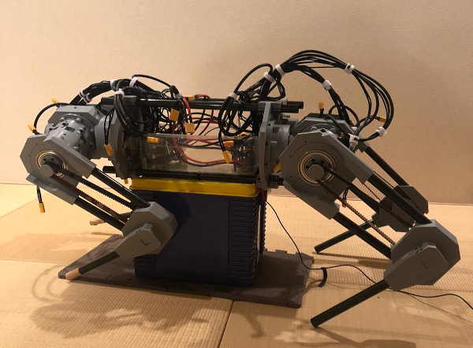(In progress)
|
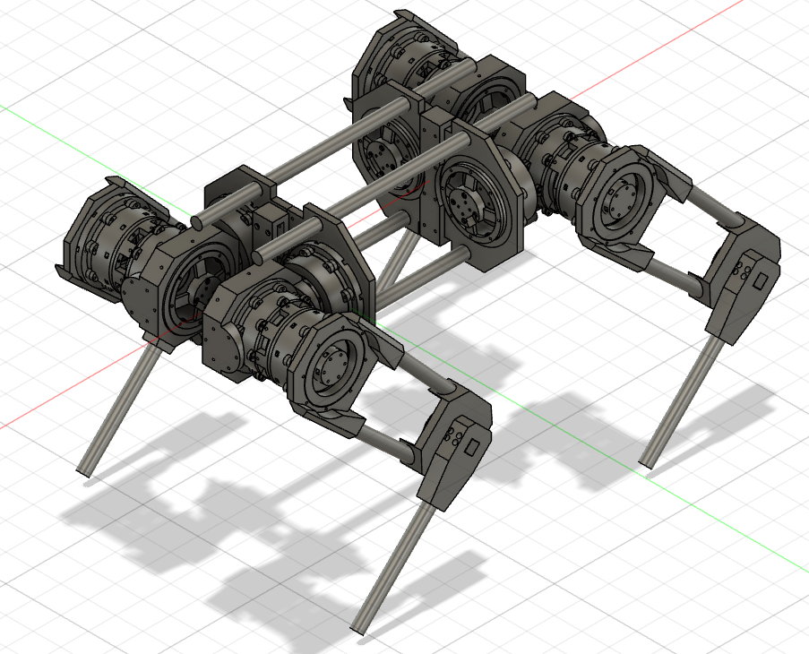(3D model)
|

## Introduction

Puguette is a fully open source 12 DOF quadruped robot. It stands at 80cm x 40cm x 60cm (when the legs are straight). It uses a BLDC motor for high torque efficiency and is coupled with a planetary gearbox to further increase said torque. The design is made to make small tweaks easy to change. For example, in order to change the gear ratio, just print the ring gear, planet gear and sun gear with the desired teeth count. Then mount that onto the motor holder. This can be done to the motor holder as well. To control Puguette, a Teensy 3.6, Jetson Nano, and 6 ODrives are used.

## Prototype

The older counterpart of Puguette, Spaghette, uses hobby servo motors. Similar to Puguette, it is 12 DOF and is fully 3D printed. In contrast to Puguette, Spaghette uses only an Arduino Mega to power it.

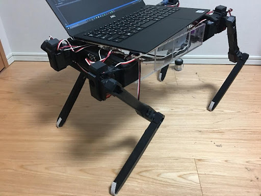

## Architecture

The Jetson Nano is the center of this robot. It communicates with the Teensy 3.6 via USB. The Teensy then communicates with all 6 ODrives using UART.

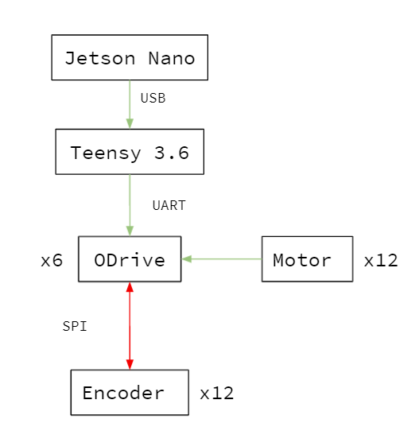
(architecture mindmap)

## Hardware Specification

There are 2 different (although similar) actuators designed. One for the x8318s motor, and one for the 8308 motor.
The total torque for each actuator is approx. 55Nm. The 8308 motor is connected to a 1:2 timing belt system to further increase torque.

| Name | Unit | Description |
| :--- | :--- | :--- |
| X8318s motor | 4 | Upper leg actuator motor |
| 8308 motor | 8 | Lower and hip abductor actuator motor |
| ODrive driver | 6 | Controls motor |
| AS5048a encoder | 12 | Measures angle |
| Teensy microcontroller | 1 | Controls ODrive via UART |
| Bearing 6900ZZ | 4 | Bearing for Upper leg actuator |
| Bearing 6000ZZ | 36 | Bearing for planet gears |
| Bearing 6006ZZ | 4 | Bearing for lower joint  |
| Bearing 6010ZZ | 8 | Bearing for 8308 motor actuator |
| Lipo Battery | 3 | Power supply for the robot |

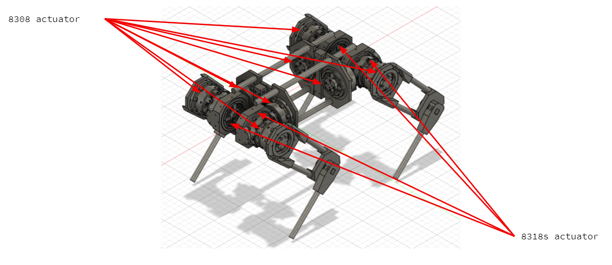
(location of actuators)

## Actuator Assembly

  1. Mount encoder onto encoder holder using m2 screws.
  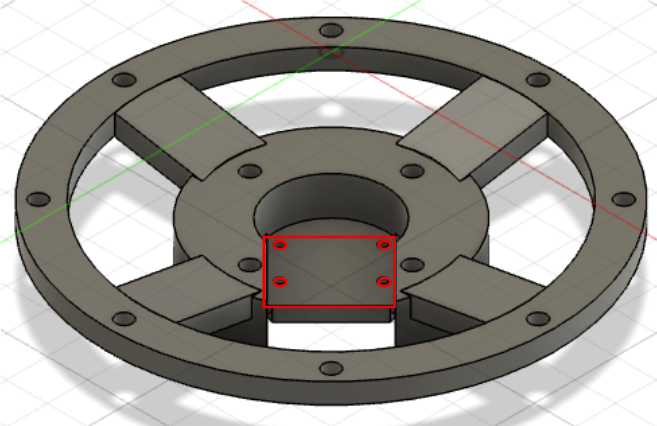
  2. Mount the encoder magnet on the motor via the magnet holder.
  3. Insert m4 hex-nuts into the sides of motor holder.
  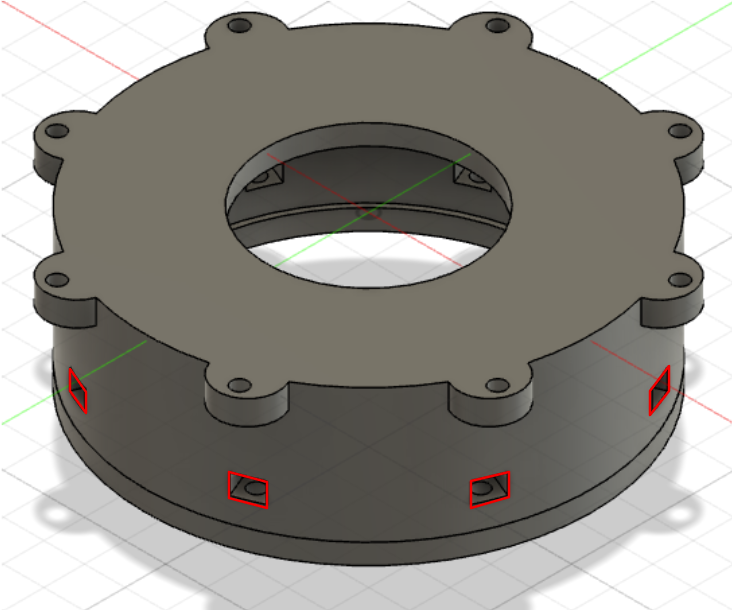
  4. Screw encoder holder onto the motor holder via the holes.
  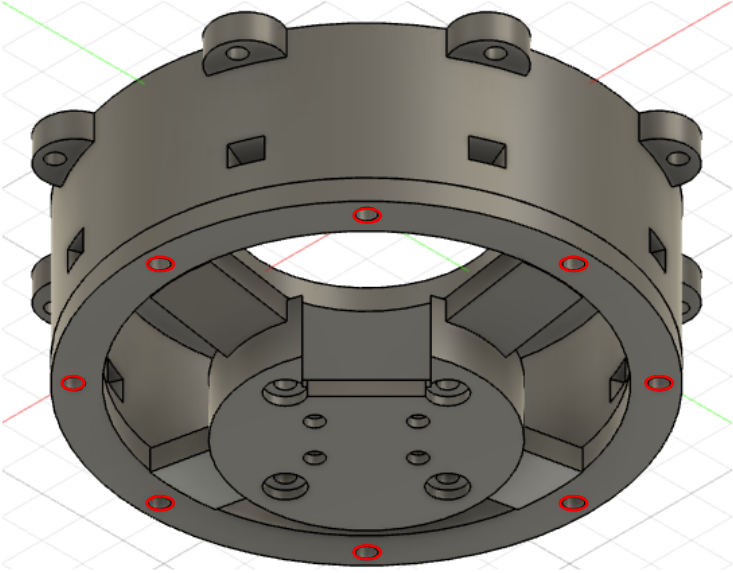
  5. Place bearings onto the ring gear, and planet gear.
  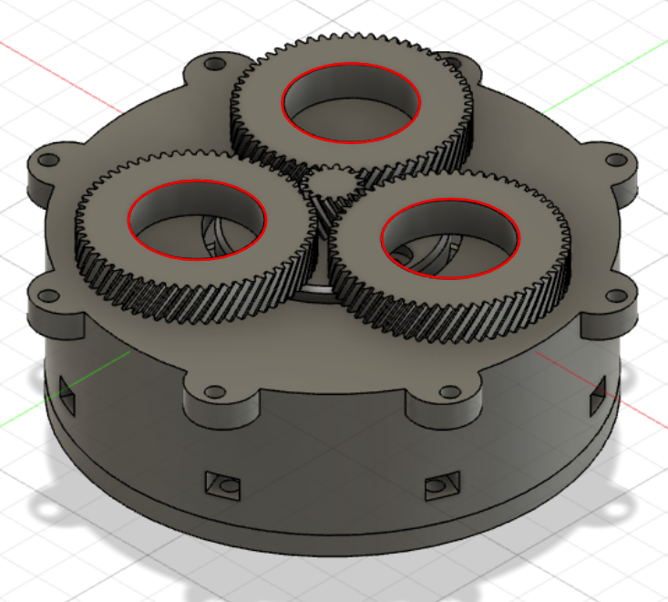
  6. Push the planet gear onto the planet gear holder.
  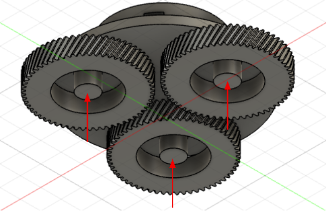
  7. Mount the sun gear onto the motor via the opening on the motor holder.
  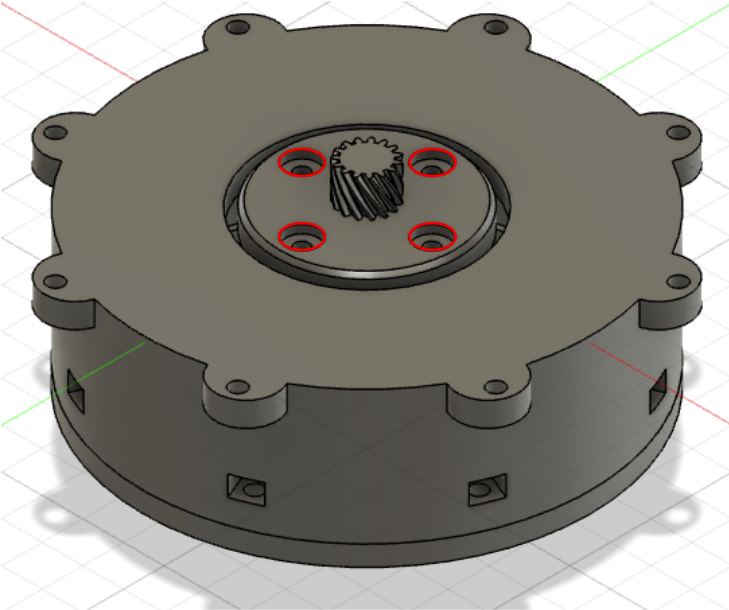
  8. Push the sun gear into the center of the planet gear and planet gear holder.
  9. Push the ring gear on top of the planet gear holder.
  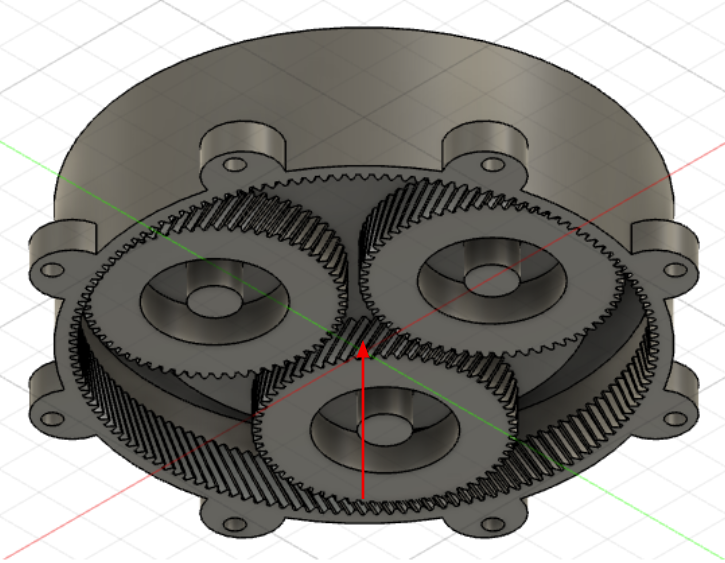
  10. Mount motor holder onto ring gear.
  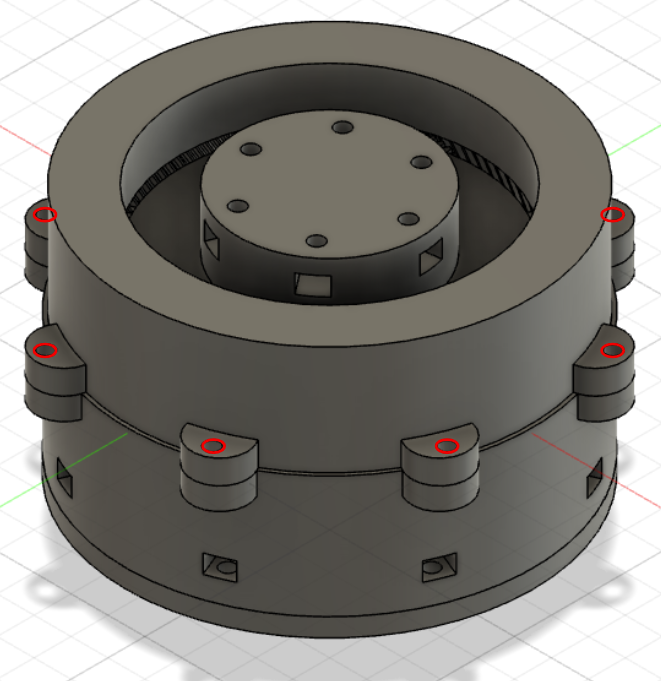
